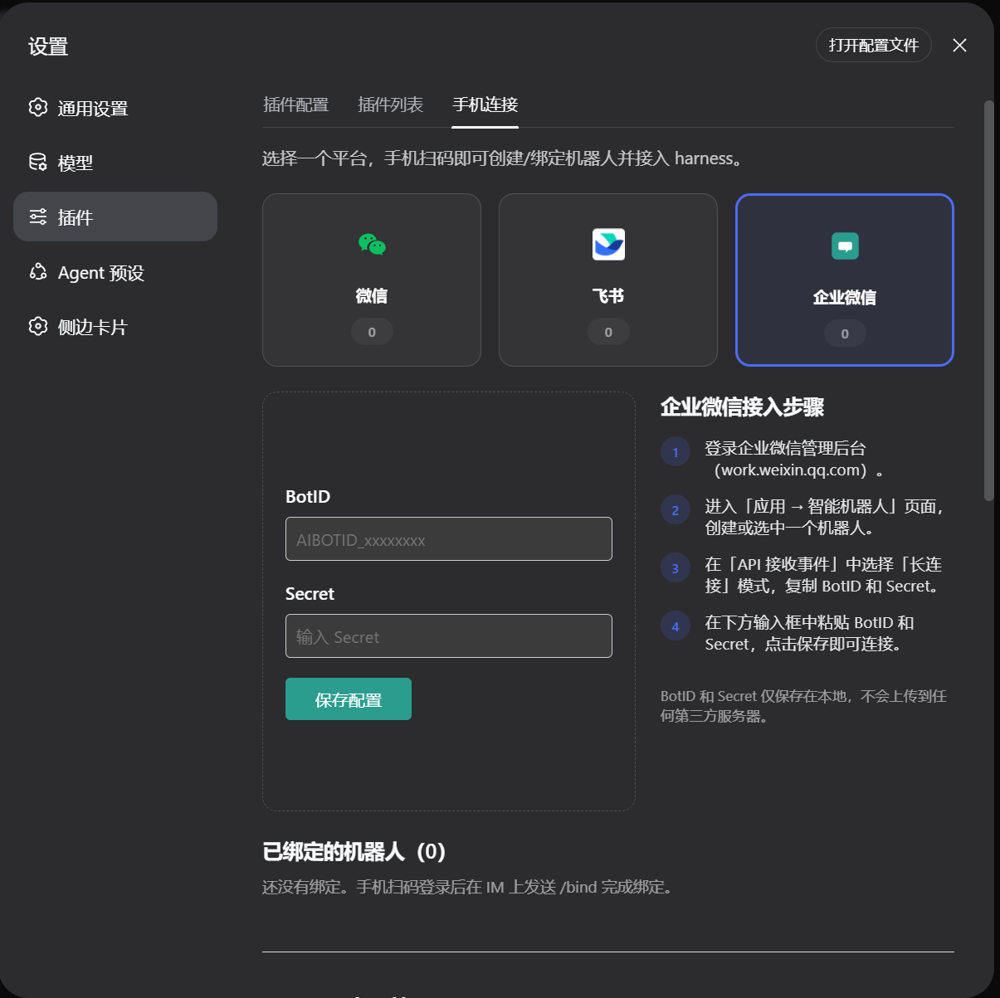

# dsh-im-bot — 手机接入 DeepSeek Harness

把 **飞书 / 微信 / 企业微信** 变成你的 DeepSeek Harness（dsh）数字分身入口：
Owner 扫码（或配置）接入机器人后，在 IM 里直接对话、调用 harness 智能体的全部工具能力，
其他所有人零门槛直接使用。



包含两个包：

| 包 | 作用 |
|---|---|
| `@dsh-extra/im-channel` | 服务端插件：扫码登录、消息路由到 agent 会话、命令系统 |
| `@dsh-extra/dsh-client-ui-settings-im` | 客户端插件：设置页里的「手机连接」标签（二维码、绑定管理） |

## 安装

### 第一步：安装 DeepSeek Harness

需要 Node.js ≥ 22 与 pnpm ≥ 9：

```sh
npm install -g @deepseek-ai/dsh
dsh web
```

打开终端提示的地址（默认 `http://127.0.0.1:8080`），在设置里配置好模型即可开始使用。

### 第二步：一条命令安装本插件

```sh
curl -fsSL https://raw.githubusercontent.com/lomehong/dsh-im-bot/main/install.mjs | node
```

（Windows PowerShell：`irm https://raw.githubusercontent.com/lomehong/dsh-im-bot/main/install.mjs | node -`）

脚本会自动写入 web profile、安装两个包并注册 bundle，可重复执行（用于升级）。默认从
npm 安装稳定版（`@dsh-extra/im-channel`），npm 未发布时自动回退 GitHub 源；
`DSH_IM_SOURCE=git` 可强制走源码。完成后重启 `dsh web` 即可。

<details>
<summary>npm 源直接安装（发布后推荐）</summary>

```sh
cd ~/.dsh/profiles/web && pnpm add -w @dsh-extra/im-channel @dsh-extra/dsh-client-ui-settings-im
```

发布流程（维护者）：`cd im-channel && pnpm build && npm publish`，`ui-settings-im` 同理；
发布前确认 `lib/` 为最新构建。

</details>

重启后终端出现下面的日志，说明插件加载成功、渠道已连接（未配置凭证的渠道自动跳过）：

```
[info]: [ 'client ready' ]
[info]: [ 'event-dispatch is ready' ]
[im-channel] feishu 长连接已建立
[im-channel] wechat getupdates ret=0 errcode=0 msgs=0 bufLen=104
```

<details>
<summary>手动安装（等价步骤）</summary>

```sh
cd ~/.dsh/profiles/web && pnpm add \
  "git+https://github.com/lomehong/dsh-im-bot.git#main&path:/im-channel" \
  "git+https://github.com/lomehong/dsh-im-bot.git#main&path:/ui-settings-im"
```

然后把两个包名（`@dsh-extra/im-channel`、`@dsh-extra/dsh-client-ui-settings-im`）加入
`~/.dsh/profiles/web/package.json` 的 `dsh.profile.bundles` 列表，重启 `dsh web`。

</details>

## 使用

<table>
  <tr>
    <td align="center">微信</td>
    <td align="center">飞书</td>
  </tr>
  <tr>
    <td></td>
    <td></td>
  </tr>
</table>

1. 打开网页 → 设置 → 插件 → **手机连接**。
2. 接入渠道（三选一或多选）：
   - **飞书 / 微信**：点对应卡片，用手机扫码（二维码可点击刷新）；
   - **企业微信**：点卡片后**用企业微信 App 扫码，一键创建智能机器人并自动完成配置**；也可展开「手动配置」填写已有机器人的 BotID 与 Secret。
3. 在 IM 里对机器人发送 `/bind` **认领分身**（只有 Owner 需要这一步），再发 `/项目` 选择工作区。
4. 其他人**什么都不用做**，直接发消息即可与你的数字分身对话。

### 数字分身模式

机器人在每个渠道（飞书/微信/企业微信）是一个**个人的数字分身**：

- **Owner**：该渠道第一个发送 `/bind` 的用户，一次性完成认领并选择工作区，是分身唯一的管理者
- **访客**：其他所有人**无需任何操作**，直接发消息即可与分身对话；消息带 `[访客·姓名]` 身份前缀，共享 Owner 的会话上下文
- **访客权限**：Owner 在「设置 → 插件 → 手机连接 → 访客权限」中配置访客可用的**工具**（默认全部禁用，纯对话）与**命令**（默认 帮助/状态/回复/停止/全文）；工具白名单支持精确名与前缀通配（如 `fs*`、`mcp__wecom*`），保存后下一轮对话即生效
- **工具审批**：需要授权的工具操作（访客白名单外、沙箱 escalate 等）会向 Owner 推送**带按钮的审批卡片**——飞书（interactive 卡片 + `card.action.trigger` 长连接回调）、企业微信（button_interaction 模板卡片 + `template_card_event` 回传），**点一下「允许/拒绝」即决策**，卡片立即定稿为终态（结果按钮替换原操作按钮，不可再点）；点击或文本回复（允许/拒绝）任一生效，3 分钟超时自动拒绝；微信等无卡片渠道自动退化为文本回复；守卫全局注册并按 parentSession 归因到根会话，**子代理派生的调用同样受控**；Owner 自己触发的审批卡片标注「你」
- **外发脱敏**：发往 IM 的内容（含流式增量与终稿）先经 harness masking 服务脱敏，敏感信息不落第三方 IM
- **图片输入**：飞书/企业微信里直接发图（PNG/JPEG/WebP/GIF，单张 ≤5MB，每轮 ≤3 张）给分身做视觉理解，可附文字说明
- **交互式提问**：agent 需要补充信息时，问题以编号选项列表推到 IM，回复序号/文字/自定义内容即作答（多选用逗号分隔）
- **补充指令**：任务运行中发送 `/补充 <指令>` 可向当前任务追加要求而不打断它
- **所有权交接**：Owner 发送 `/unbind` 释放渠道，下一个 `/bind` 者成为新 Owner

### 流式回复与打断

对话过程实时同步到 IM，不再「黑屏等结果」：

- **飞书**：优先使用 CardKit 流式卡片——文字以**打字机效果逐字上屏**，结束后定稿为完整 markdown 回复（代码块高亮）。需要在开放平台给应用开通 `cardkit:card:write` 权限；未开通时自动降级为卡片整刷（约每秒一次）。
- **微信**：过程按批次追加消息（协议不支持编辑已发消息），只发增量。
- **企业微信**：走智能机器人的流式回复通道；不可用时降级为最终一次性回复。
- **打断**：agent 执行中直接发新消息即可打断当前任务并开始新输入，不需要先 `/停止`。
- **会话恢复**：`dsh web` 重启后无需重新 `/bind`，分身会话自动重连（历史上下文继续）；确实无法恢复时自动重建，访客无感跟随。

每轮结束附带 token 用量页脚；详细模式下流式卡片还会展示 agent 的任务清单进度（todo 快照）。回复详细程度（`/回复`）控制流式推送的粒度：**简洁**=过程只显示工具计数、只发最后一条 AI 消息；**标准**=文字段落边生成边推送（默认）；**详细**=工具调用过程 + 全部 AI 消息实时推送。

### 机器人命令

管理命令仅 Owner 可用；访客可用命令默认为 帮助/状态/回复/停止，Owner 可在「访客权限」面板调整。

| 命令 | 权限 | 说明 |
|---|---|---|
| `/bind` | 未认领时任何人 | 认领本渠道的数字分身（成为 Owner）；已有 Owner 时其他人执行会被拒绝 |
| `/unbind` | Owner | 释放分身（渠道回到未认领态，下一个 `/bind` 者接任） |
| `/项目` / `/项目 N` | Owner | 查看 / 切换工作区（新开线程） |
| `/新建` 或 `/clear` | Owner | 清空分身上下文，开新任务 |
| `/模型` / `/模型 N` | Owner | 查看 / 切换模型 |
| `/思考 N` | Owner | 切换思考级别（按当前模型支持的级别列出） |
| `/回复 N` | 访客可用 | 流式推送详细程度（个人偏好）：1 简洁 / 2 标准 / 3 详细 |
| `/停止` | 访客可用 | 中断分身正在执行的任务 |
| `/全文 <编号>` | 访客可用 | 取回被截断长回复的全文（超长回复自动落盘，先发预览） |
| `/压缩` | Owner | 主动压缩会话上下文（`/状态` 可查看 token 水位） |
| `/补充 <指令>` | 访客可用 | 向运行中的任务追加指令（不打断） |
| `/状态` | 访客可用 | 查看工作区、模型、分身会话与自己的身份 |
| `/帮助` | 访客可用 | 命令列表 |

### MCP 服务器管理

设置页「手机连接」标签底部可管理 MCP 服务器（streamable-http 协议）：添加/编辑/删除服务器后，
其工具会注册到分身会话中，模型可直接调用。访客能否使用 MCP 工具由访客权限白名单控制
（可用前缀通配如 `mcp__wecom*` 放行整个命名空间）。

添加服务器以「粘贴」为中心，无需逐项手填：

- **粘贴即添加**：在输入框粘贴服务器地址（每行一个），或直接粘贴 Claude Code / Cursor 等
  客户端的标准 `mcpServers` JSON 配置，粘贴后自动解析出候选列表；
- **名称可省略**：自动取自 JSON 键名或 URL 主机名，解析后仍可修改；
- **保存前自动测试连接**：每个候选自动探测可达性并显示可用工具数，连不通的会标出原因
  （超时 / 网络不可达等），勾选后一键批量添加，重复地址自动跳过；
- **已有服务器**：支持一键「测试」查看健康状态与工具数、行内编辑名称/URL、二次确认删除。

```json
{
  "mcpServers": {
    "待办": { "type": "streamable-http", "url": "https://mcp.example.com/mcp" }
  }
}
```

> 仅支持 HTTP 流式（url）服务器；粘贴 stdio（command）配置会提示暂不支持。

### 控制台机器人状态栏

对话主区右缘常驻一个**机器人状态竖栏**（挂在 shell 右侧 overlay 层，不占用工具详情栏）：

- **折叠竖签**（默认）：三个平台的图标 + 状态点（绿=在线、黄=已配置离线、灰=未绑定），一眼可见；
- **点击展开**：每个平台一张小卡——账号标识（微信 accountId / 飞书 appId / 企微 botId）、
  在线状态、该平台已 `/bind` 的用户数；
- **数据口径**：`configured` = 本地凭证存在；`online` = 路由器当前持有该平台通道实例
  （连接循环运行中，断线自动重连）；数据 30 秒轮询，页面隐藏时暂停；
- **避让**：打开工具详情栏时状态栏自动左移贴其左缘，关闭后回到视口右缘。

对应后端端点：`GET /im-channel/bots/status`。

### 访问控制（可选）

默认所有能给机器人发消息的用户都可对话。如需限制，在 `~/.dsh/settings.yaml` 的 `im-channel:` 节配置白名单：

```yaml
im-channel:
  allowlist:
    - ou_xxxxxxxx        # 飞书 open_id
    - wechat:wx_yyyyyy   # 或 kind:userId 形式
```

不在名单内的消息会被静默忽略。飞书群聊中机器人只响应被 @ 的消息。

## 从源码开发

```sh
git clone https://github.com/lomehong/dsh-im-bot.git
cd dsh-im-bot/im-channel && pnpm install && pnpm build && pnpm test   # 63 个单测
cd ../ui-settings-im && pnpm install && pnpm build
```

构建产物 `lib/` 随仓库提交，GitHub 安装无需本地构建步骤。

本机联调（改码即时生效）：`node refresh-local.mjs` 会构建 im-channel 并把两个包的产物
直接同步进 `~/.dsh/profiles/web`（绕过 pnpm 对本地包的缓存），之后重启 `dsh web` 即可。
注意：若改动涉及 im-channel 的依赖清单（package.json dependencies），需把版本号 +0.0.x
后在 profile 里 `pnpm install`，运行时依赖才会跟进。

## 许可证

MIT
